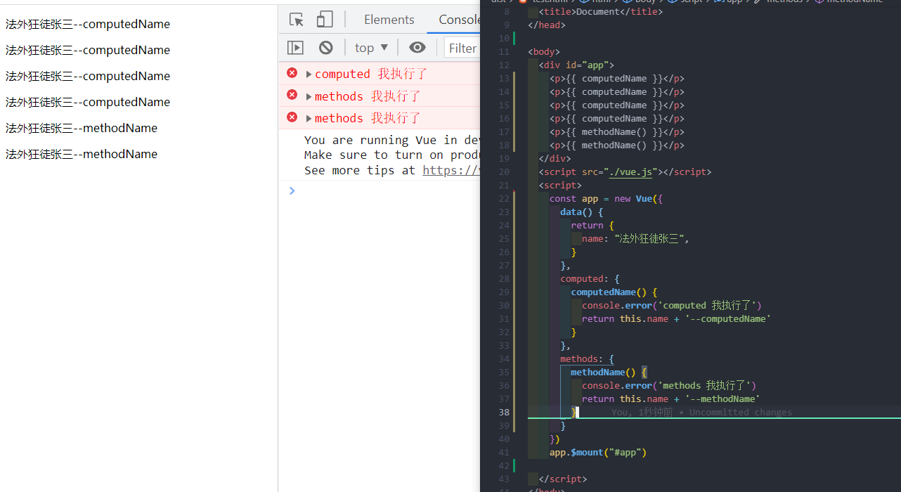

## computed和methods

computed 计算一次 页面中多次使用 不会再次执行 除非依赖的数据发生改变
methods 使用一次执行一次



```js
//  template 
     <div id="app">
    <p>{{ computedName }}</p>
    <p>{{ computedName }}</p>
    <p>{{ computedName }}</p>
    <p>{{ computedName }}</p>
    <p>{{ methodName() }}</p>
    <p>{{ methodName() }}</p>
  </div>

    //template转为后的 render 函数
    (function anonymous() {
        with(this) {
            return _c('div', {
                attrs: {
                    "id": "app"
                }
            }, [_c('p', [_v(_s(computedName))]), _v(" "), _c('p', [_v(_s(computedName))]), _v(" "), _c('p', [_v(_s(computedName))]), _v(" "), _c('p', [_v(_s(computedName))]), _v(" "), _c('p', [_v(_s(methodName()))]), _v(" "), _c('p', [_v(_s(methodName()))])])
        }
    })
```

```js
_s(computedName) 触发 get   
function createComputedGetter(key) {
    return function computedGetter() {
        var watcher = this._computedWatchers && this._computedWatchers[key];
        if (watcher) {
            // 首次进入watcher中的 dirty 为true  执行计算
            if (watcher.dirty) {
              // evaluate() 后  this.dirty = false;  watcher.value 缓存成功 下次获取直接返回  watcher.value
                watcher.evaluate(); 
            }
            if (Dep.target) {
                watcher.depend();
            }
            return watcher.value
        }
    }
}
```

